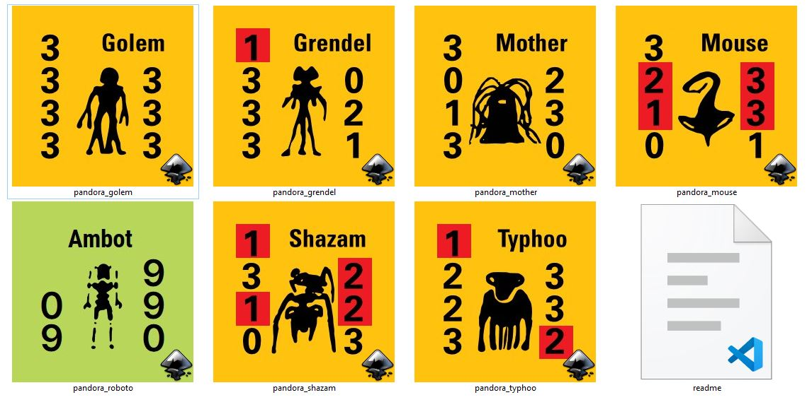

+++
title = "Pandora Counters"
description = "Ares Classics"
date = 2022-01-28
author = "John Edwards"
tags = ['counters']
draft = "false"
+++

## The Voyage and Wreck of the BSM Pandora

The two *Pandora* games published in Ares magazine are SPI classics. wartwork has been working to clean up and re-create them for fun, possible use in a vassal module, or for use in some Universe campaigns. My preferred model for counters now is SVG, which is compact and really crisp at all sizes.

The counter work is available on Github at https://github.com/jzedwards/jzcounters/tree/main/pandora

