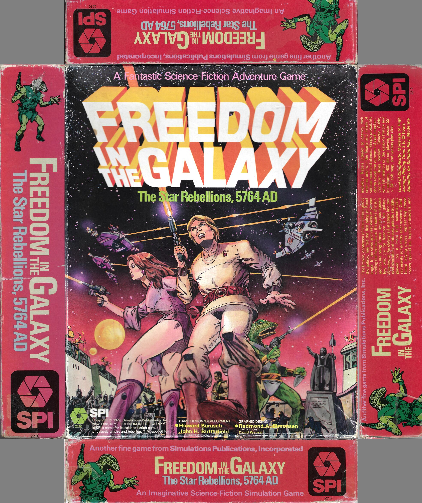

+++
title = "FitG Cover Box Layout"
description = "Freedom in the Galaxy"
date = 2022-01-30
author = "wartwork"
tags = ['covers']
draft = "false"
+++

## Scanned Box Layout

*Freedom in the Galaxy* is SPI's version of Star Wars, from 1979. It is one of my treasured games, despite not being great solo, and being prety imbalanced.

My box reflects its well-loved history, but the box scan on [Boardgamegeek](https://www.boardgamegeek.com) was really poor, so I scanned my box at 600ppi, using vuescan

Of course, boxes were printed and folded, with 2" sides in the case of *FitG*, so I have a Photoshop PSD template with a set of 5 masks for the front and sides. The high quality scans are available at [Simpubs](https://www.simpubs.org)

