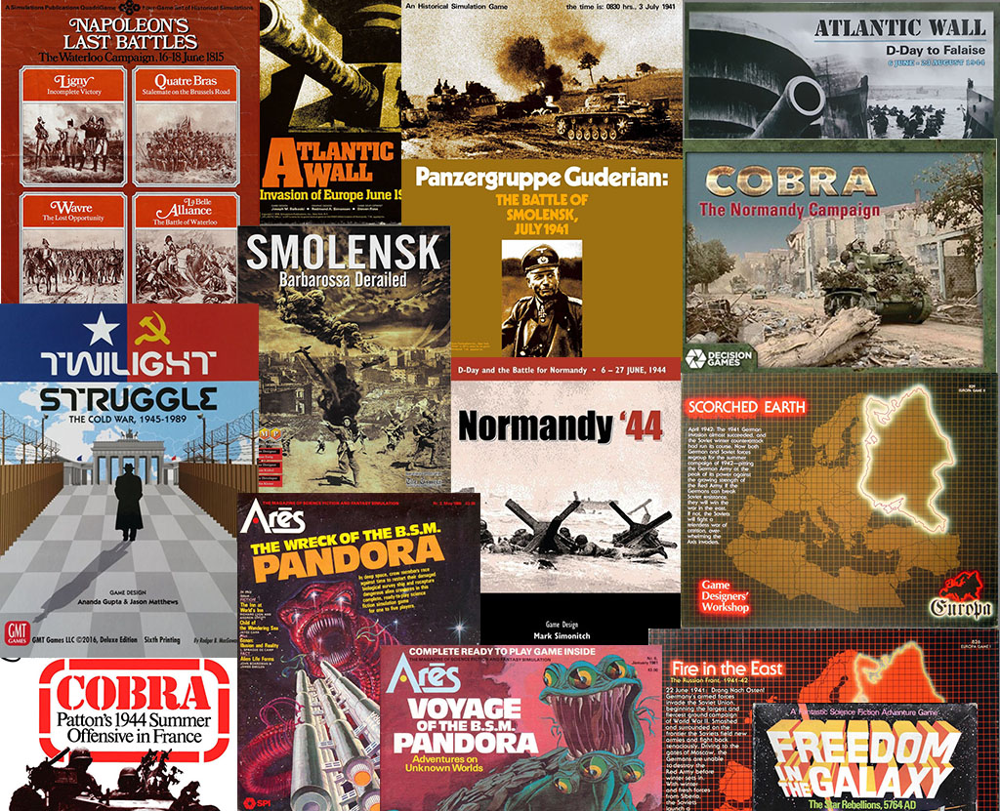

+++
title = "Favourite Wargames"
description = "Our favourite board and computer games"
date = 2022-01-29
author = "wartwork"
tags = ['favs']
draft = "false"
+++

## wartwork's Favourite Wargames
wartwork is all about wargames, and we have some favourites. As you will see elsewhere, classic 70s and 80s games from SPI and GDW are our top picks, even today.

## Top of the Pops
These are 10 (+) of our all time favourites, in no particular order

- Panzgruppe Guderian (SPI)
- Fire in the East/Scorched Earth (GDW)
- Smolensk: Barbarossa Derailed (OCS Series, MMP)
- Atlantic Wall (SPI and Decision Games)
- Pandora - The Voyage of the BSM Pandora and The Wreck of the BSM Pandora (SPI)
- Cobra (SPI and Decision Games)
- Napoleon's Last Battles (SPI)
- Holland '44 (GMT)
- Freedom in the Galaxy (SPI)
- Twilight Struggle (GMT)

*Guderian* gets in for the game and the system, spawning Operation Typhoon, The Army Group South quad, and many more.

*FitE* and *SE* represent the ground breaking Europa system, a work of genius from John Astell and Frank Chadwick.

*Smolensk* represents the brilliant Operational Combat Series, in my view the best 'divisional' scale simulation of WW2 era conflict. it wins over Guderian's Blitzkreig and Case Blue on the playable scale (for me...)

I am cheating with Atlantic Wall, including both the flawed SPI masterpiece (bocage...) and the DG Grand Operational version, which is a masterpiece of design (if not playability).

Two Pandoras (cheating again) are a tribute to John Butterfield, who has designed some of the best solo games, ever (and whose *RAF* and *Ambush* probably deserve a spot).

*Cobra* and *NLB* represent the best of SPI, but also include a nod to the great design of the DG Cobra rework (Jo Youst's work again) and the OSG *Library of Napoleonic Battles* by Kevin Zucker.

*Holland 44* again represents a brilliant series - Mark Simonitch's 4X, and was in a close fight with *Normandy 44* and *Stalingrad 42*.

*Freedom in the Galaxy* is again flawed, but is a totem of my teenage years.
Finally, TS is here because it is not a wargame ;-) 

Of course, my preponderance of SPI games reflects my view that Redmond A Simonsen is a god of graphic design.

**Omissions?** Seems I have missed Avalon Hill, but they did games, not simulations... Chris Fasulo's brilliant *DeathRide Normandy* is taking a lot of my current brainpower (and $), and one day I will give John Bannerman's TSWW monsters the time they deserve. I note I have missed *Terrible Swift Sword* and GBACW, but tbh I am a WW2 guy.

## Computer Games
*Gary Grigsby's War in the East* is **the** best computer wargame, ever. In my personal opinion, *War in the West* is not quite up to the same standard, probably becuase of the imbalance of forces, just like real life.

The *Decisive Campaigns* series is better than beer'n'pretzls, but very playable - I have just got the Ardennes

Mention in despatches - *TOAW IV* The Operational Art of War is a brilliant game that I cannot quite get into - I appreciate its quality, but there is something that does not gel for me

