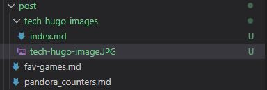

+++
title = "Hugo posts and images"
description = "How to store images with content"
date = 2022-01-30
author = "John Edwards"
tags = ['tech']
draft = "false"
+++

## Hugo and Image Content Management


The Hugo site generator has enormous flexibility in content, which is powerful, but confusing, as there is no single best practice.

Adding images to posts can be a pita, as they are usually stored in a (static) content folder, with a reference like 
``````

but this doesn't work in preview, so the alternative is to set up each post as a folder, with an `index.md` file and store the images locally. However, it is not so quick and easy to create a new post, as it needs a folder - more on that later (If I work it out)

My posts are setup in folders based on guidance from https://discourse.gohugo.io/t/discussion-content-organization-best-practice/6360/3 

